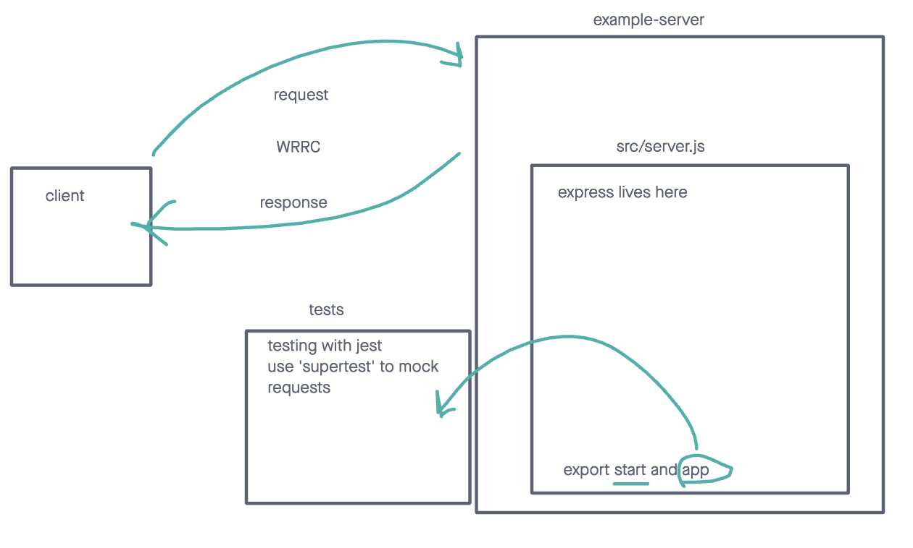

# LAB - Class 01

## Project: server-deployment-practice

### Author: Heather Holcomb

### Problem Domain

This very basic express server is used as a base for CI/CD deployment exercises

### Links and Resources

- [GitHub Actions ci/cd](https://github.com/holcombheather/example-server/actions)
- [back-end server prod url](https://exampler-server-prod.onrender.com)
- [back-end server dev url](https://dev-1gtj.onrender.com)
- [repo](https://github.com/holcombheather/example-server)

### Collaborators

Used code from in-class demo from Ryan Gallaway (with permission).

### Setup

#### `.env` requirements (where applicable)

port variable exists within the env sample

#### How to initialize/run your application (where applicable)

clone repo, `npm i`, then run `nodemon` in the terminal

#### Routes

- GET : `/success` - specific route to hit

#### Tests

To run tests, after running `npm i`, run the command `npm test`

#### UML

